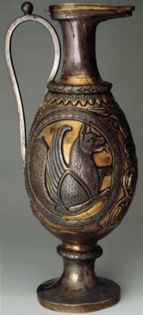
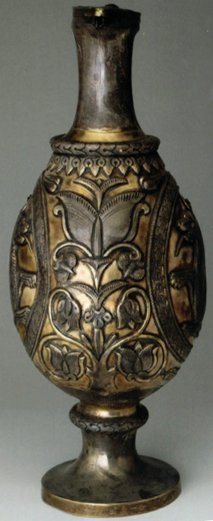

# Ewer representing the Simorgh

 

Typical Sasanian ewer with medallions on two sides containing images of the Simorgh.

Between the medallions are sacred trees.

A Sasanian floral design decorates the ewer and lid.

Found in 1833 near Pavlovka in the Kharkov region (Ukraine).
