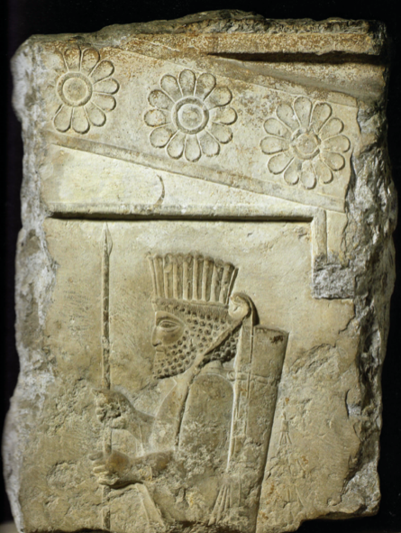

# Fragment of carved limestone relief



This fragment was found fallen from the north side of the Apadana at Persepolis in 1811.

It shows a guardsman wearing so-called Persian dress with
a pleated headdress, possibly made of felt, holding a spear in both hands and wearing a strung bow with tips ending in birds' heads over his left shoulder.

There is a tasselled quiver on his back.

Beneath is a cornice decorated with 12-petalled rosettes.

Isolated microscopic specks of Egyptian Blue pigment survice on the face of the stone near the spear tip.

Such figures are popularly identified with the 'Immortals', described by the Greek historian Herodotus and are shown at Persepolis along with figures of the king, courtiers, officials and tributaries.

All were originally highly coloured, but few traces of the original paints survive.

## Map

```geojson
{
  "type": "Feature",
      "geometry": {
        "type": "Point",
        "coordinates": [52.89, 29.9368]
      },
      "properties": {
        "wikipedia": "https://en.wikipedia.org/wiki/Apadana"
      }
}
```
